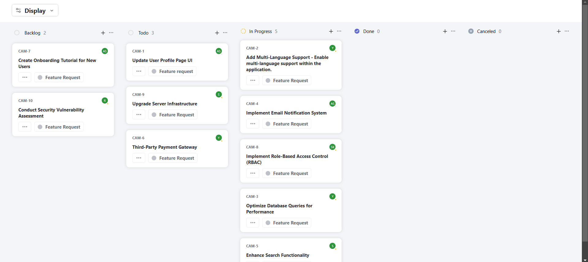
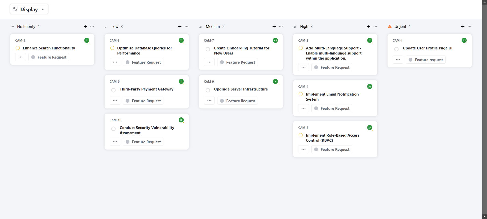
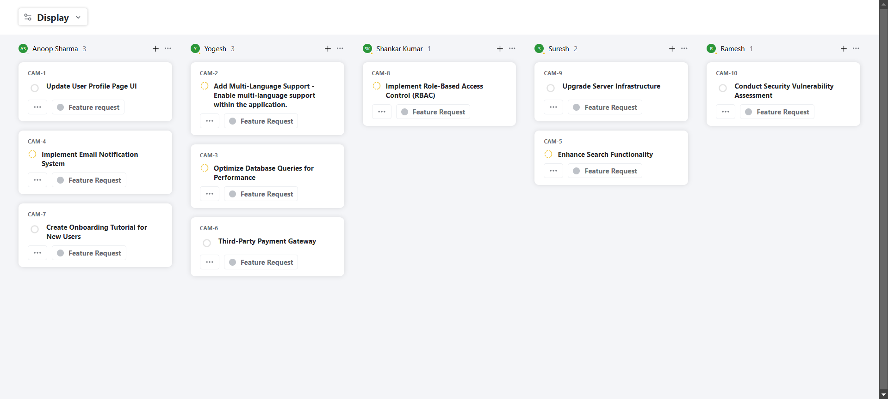

# 📋 Kanban Board Application

A **React-based Kanban Board Application** designed to dynamically group and sort tickets fetched from an external API. The application offers users an interactive and visually appealing interface to manage and organize tasks.

---

## 👤 Personal Details

- **Name:** Utkarsh Raj
- **Roll Number:** 21BCS229
- **College Email:** [21bcs229@iiitdmj.ac.in](mailto:21bcs229@iiitdmj.ac.in)
- **Hosted Site:** [View Project Here](#)

---

## 📌 About the Project

This application interfaces with the provided [API by Quicksell](https://api.quicksell.co/v1/internal/frontend-assignment), allowing users to view and organize tickets dynamically. Users can group tickets by **Status**, **User**, or **Priority** and sort them by **Priority** or **Title**.

The priority levels are mapped as follows:

- **Urgent**: Level `4`
- **High**: Level `3`
- **Medium**: Level `2`
- **Low**: Level `1`
- **No Priority**: Level `0`

The Kanban board persists the user's preferences, ensuring a seamless experience even after a page reload.

---

## 🖥️ Tech Stack

### **Frontend:**

- **React JS** &nbsp;
- **JavaScript** &nbsp;
- **CSS** &nbsp;
- **React Router** &nbsp;

---

## ⚙️ Features

1. **Dynamic Grouping**:

   - Group tickets by **Status**, **User**, or **Priority**.

2. **Sorting**:

   - Sort tickets by **Priority** (descending order) or **Title** (ascending order).

3. **Responsive Design**:

   - Ensures a smooth experience across different screen sizes.

4. **Persistent State**:

   - Saves the user's preferences (grouping and sorting options) even after a page reload.

5. **API Integration**:
   - Fetches data dynamically from [Quicksell API](https://api.quicksell.co/v1/internal/frontend-assignment).

---

## 🛠️ Installation and Setup

### 1. Clone the repository:

```bash
git clone <repository-url>
cd <project-folder>
```

### 2. Install dependencies:

```bash
npm install
```

### 3. Start the application:

```bash
npm start
```

### 4. Access the app:

Navigate to `http://localhost:3000` in your browser.

---

## 📜 API Integration

The app fetches data from the provided API:

- **Endpoint**: [https://api.quicksell.co/v1/internal/frontend-assignment](https://api.quicksell.co/v1/internal/frontend-assignment)
- **Data Structure**:
  ```json
  {
    "tickets": [
      {
        "id": "1",
        "title": "Sample Ticket",
        "status": "Backlog",
        "priority": 2,
        "userId": "123"
      },
      ...
    ],
    "users": [
      {
        "id": "123",
        "name": "John Doe"
      },
      ...
    ]
  }
  ```

---

## 🚀 Usage

1. Launch the app and click the **Display** button to fetch data.
2. Use the dropdown menus to:
   - Group tickets by **Status**, **User**, or **Priority**.
   - Sort tickets by **Priority** or **Title**.
3. The Kanban board updates dynamically based on your selections.
4. Your preferences persist after a page reload.

---

## 🎨 Screenshots

### Kanban Board - Grouped by Status:



### Kanban Board - Grouped by Priority:

## 

### Kanban Board - Grouped by User:

## 
